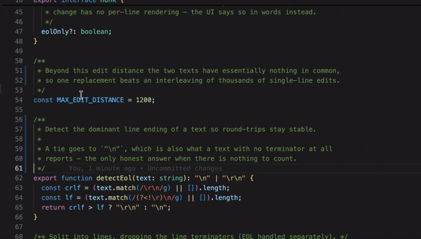

<p align="center">
  
</p>

<h1 align="center">Keep / Undo for Claude Code</h1>

<p align="center">
  Review every change <a href="https://claude.com/claude-code">Claude Code</a> makes to your files and
  decide, hunk by hunk, whether to <b>Keep</b> it or <b>Undo</b> it — the same review loop
  GitHub Copilot gives you for its own edits.
</p>

<div align="center">
  <a href="https://marketplace.visualstudio.com/items?itemName=FedeFluork.claude-keep-undo"></a>
  <a href="https://marketplace.visualstudio.com/items?itemName=FedeFluork.claude-keep-undo"></a>
  <a href="https://open-vsx.org/extension/FedeFluork/claude-keep-undo"></a>
</div>
<div align="center">
  <a href="https://code.visualstudio.com/"></a>
  <a href="https://github.com/FedeFluork/claude-keep-undo/blob/HEAD/LICENSE"></a>
</div>

<br/>

<p align="center">
  
</p>

<br/>

> **Unofficial.** This is a community project. It is not affiliated with,
> endorsed by, or sponsored by Anthropic. *Claude* and *Claude Code* are
> trademarks of Anthropic, PBC.

---

## Why

Claude Code edits files directly on disk. That is fast, but it leaves you
without the "here is what changed, accept or reject it" step you get from an
IDE-integrated assistant. This extension adds that step back — in the editor you
are already looking at, without a diff tab.

**Keep** folds the change into the recorded baseline (the file stays as Claude
wrote it). **Undo** rewrites the file back to the baseline. Either way, once
baseline and file agree, the file leaves the review queue.

## Highlights

- **Review in place.** Coloured change bars in the real editor gutter; click one
  and VS Code's Quick Diff widget opens inline with **Keep** and **Undo** in its
  toolbar. Inline comment threads are available as an alternative rendering.
- **Keyboard loop.** `Ctrl+Alt+N` / `Ctrl+Alt+P` to walk the changes,
  `Ctrl+Alt+K` / `Ctrl+Alt+U` to keep or undo the one under the caret, or
  `Ctrl+.` / `Cmd+.` for the same two actions as Quick Fixes.
- **A pending queue you cannot lose track of.** `✳` badges in the Explorer, a
  status bar count, a *Claude: Changes to Review* tree expandable down to
  individual hunks, and a Source Control entry — each one switchable.
- **One pass over everything.** *Review All Claude Changes* opens every pending
  file in a single Multi Diff Editor tab, with Keep All / Undo All at hand.
- **Undo is reversible.** Every destructive action is snapshotted, lands on the
  editor's undo stack, and is confirmed by a notification with a **Restore**
  button. A change that moved since the button was drawn is refused, never
  applied to whatever now occupies that position.
- **Files you can keep out of it.** A `.keepundoignore` in the project root, with
  the syntax you already know from `.gitignore`. An ignored file is not detected,
  not queued, and — because the rule is enforced inside the hook too — never read
  or copied aside. That last part is the point for a `.env`.
- **Shell commands too.** Claude does not only use its edit tools: it runs
  `sed -i`, redirects into a file, moves things, runs a formatter or a code
  generator. Those changes are reviewed like any other — a file the command
  created can be undone away, and one it modified is restored to what it held
  before, recovered from Git or from a copy taken beforehand.
- **Zero-config, or exact.** It works from the session transcript alone — reading
  Claude Code's own pre-edit copy of a file where there is one, including the
  files a subagent changed — and installing the Claude Code hooks adds precise
  real-time baselines and full coverage.
- **Fully local, stable API only.** No network calls, no telemetry, no account,
  no proposed APIs. State survives a reload and lives outside your repository.

📖 **[Full reference →](REFERENCE.md)** — every surface, setting and command, how
change detection works, the known limitations, and how to build it.

## Requirements

VS Code `^1.90.0` · Node.js `>= 18` on your `PATH` (the hook script needs it) ·
Claude Code with `PreToolUse`/`PostToolUse` hook support · a workspace folder
open.

## Installation

Search for *Keep / Undo for Claude Code* in the Extensions view
(`Ctrl+Shift+X` / `Cmd+Shift+X`), or:

```bash
code --install-extension FedeFluork.claude-keep-undo
```

## Quick start

1. Open a project where you use Claude Code.
2. On first activation the extension offers to install its Claude Code hooks.
   Accept for precise, real-time detection — or choose **Transcript only** and it
   works with zero configuration.
3. Let Claude edit some files. They pick up an `✳` badge in the Explorer,
   coloured bars in the gutter, and an entry under **Claude: Changes to Review**.
4. Click a gutter bar and press **Keep** or **Undo** in the widget that opens —
   or review from the keyboard, or from a diff tab.
5. Finish with Keep All / Undo All from the editor title bar, the changes view
   toolbar, or the Source Control title bar.

Too much on screen, or not enough? **Claude Keep/Undo: Settings and Setup** turns
every surface on or off, with three presets — *Minimal*, *Recommended*,
*Everything*. See the
[settings reference](REFERENCE.md#settings) for the full list.

## How it works

Two complementary detection mechanisms, both on by default:

- **Claude Code hooks** — `PreToolUse` captures the file before Claude writes,
  `PostToolUse` publishes it as a baseline once the write lands. Exact, and never
  blocks a tool call.
- **The session transcript** — a zero-config fallback that reconstructs the
  pre-Claude content by reverse-applying the recorded edits, then *proves* the
  result by replaying them forward against the file on disk. Where the answer
  cannot be established exactly the file is listed as *not reviewable* instead of
  shown against a guessed baseline, so coverage is partial by design.

Baselines and recovery snapshots go into VS Code's global storage
(`globalStorage/folders/<hash>`), keyed by folder path — never into your
repository. The same repo opened alone or in another window keeps the same
review queue. [How change detection works →](REFERENCE.md#how-change-detection-works)

## Known limitations

The big ones — the [full list](REFERENCE.md#known-limitations) is in the
reference, and each one is a constraint of VS Code's **stable** extension API:

- It is not Copilot's exact widget: phantom deleted lines live in VS Code core
  and are not exposed to extensions at all.
- In a Git repository you may see two sets of gutter bars, and a second
  *Claude Changes* entry appears in the Source Control view.
- Without the hooks, an edit whose original cannot be established exactly is
  listed with an explanation rather than reviewed.
- Reviewing what a shell command changed needs the hooks **and a Git
  repository**. Outside one, or with Git unavailable, those changes are not
  detected — the extension says so once instead of leaving the queue quietly
  empty. Claude's ordinary edit tools are unaffected either way.
- UTF-8 text only. Multi-root workspaces are supported: each folder has its
  own review queue, and state is keyed by folder so the same repo in another
  window keeps its pending reviews.

## Privacy

No network requests, no telemetry, nothing sent anywhere. The extension reads
your workspace files and your local Claude Code session transcripts, and writes
baselines and recovery snapshots into VS Code's global storage
(`globalStorage/folders/<hash>`), keyed by folder path — outside your
repository. All of it stays on your machine. Anything listed in
[`.keepundoignore`](REFERENCE.md#ignoring-files) is not read at all.

## Development

```bash
npm install
npm run compile     # or: npm run watch
npm test            # unit + integration
npm run package     # builds claude-keep-undo-<version>.vsix
```

Press **F5** (*Run Extension*) for an Extension Development Host. Details,
including the project layout, are in the
[reference](REFERENCE.md#development).

## Contributing

Issues and pull requests are welcome at
[github.com/FedeFluork/claude-keep-undo](https://github.com/FedeFluork/claude-keep-undo).
Please keep changes dependency-free — the extension intentionally ships with no
runtime dependencies.

## License

[MIT](LICENSE) © FedeFluork
